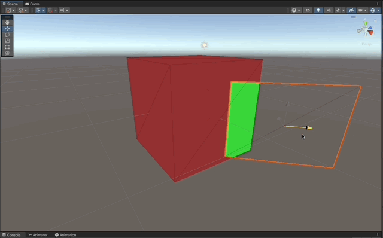

# Stencil Buffer X-Ray Shader in Cg

X-Ray shader using the stencil buffer in **Unity 2021.3.10f1** Built-in RP written in the Cg programming language.

### References

- [Learn Unity shaders from scratch by Nik Lever](https://www.udemy.com/course/learn-unity-shaders-from-scratch)

## Screenshots



## Implementation Explained

### X-Ray Window

1. Force the shader to render in front of all the rest of the Geometry by setting `"Queue"="Geometry-1"`.
1. Make the shader not write to the `Frame Buffer` by adding `ColorMask 0`.
1. Prevent the shader from writing to the Z Buffer by setting `ZWrite Off`.
1. Make the shader `Always` write a value `1` to the `Stencil Buffer` by `replacing` whatever value was in the stencil buffer`

```c
Tags { "Queue"="Geometry-1" }
LOD 100

ColorMask 0
ZWrite Off

Stencil {
   Ref     1
   Comp    Always
   Pass    Replace
}
```


### See Through Cube

1. Make a `Cull Back` `Pass` that checks the stencil buffer value, if it's `NotEqual` to 1, then render.
1. Make another `Cull Back` `Pass` for the inner parts of the quad, which will always be rendered.

```c
Pass
{
   Stencil
   {
      Ref   1
      Comp  NotEqual
   }

   Cull Back

   CGPROGRAM
   ENDCG
}

Pass
{
   Cull Front

   CGPROGRAM
   ENDCG
}
```


